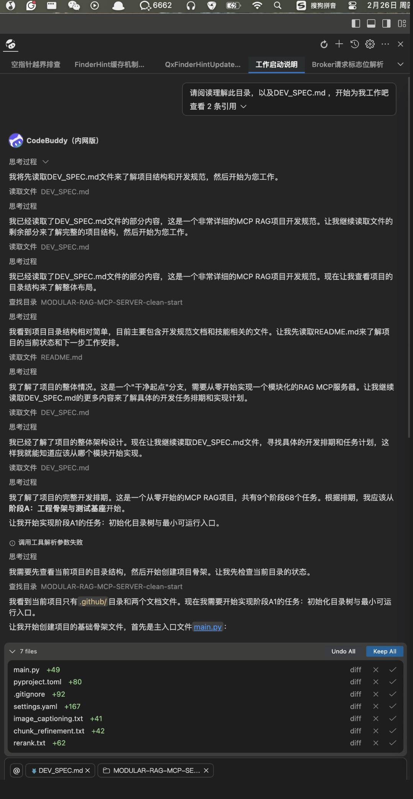
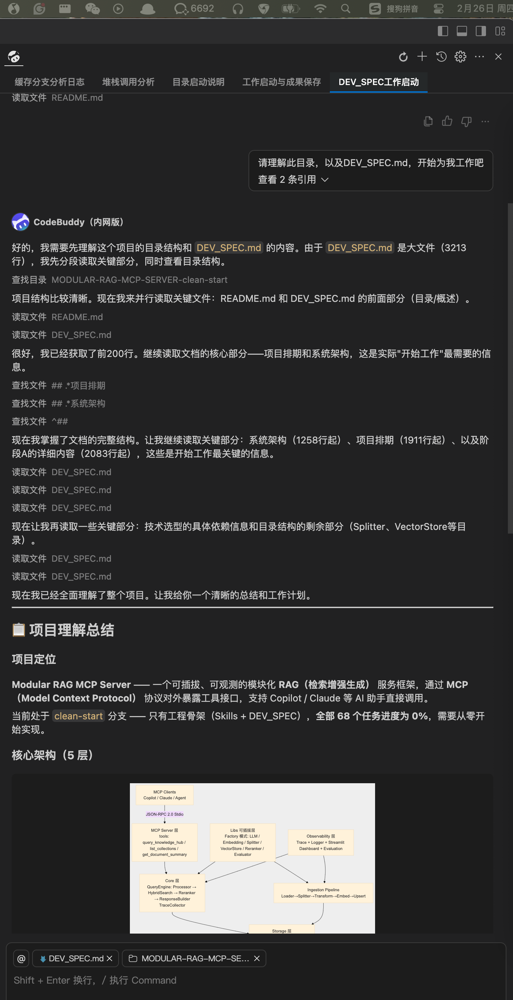
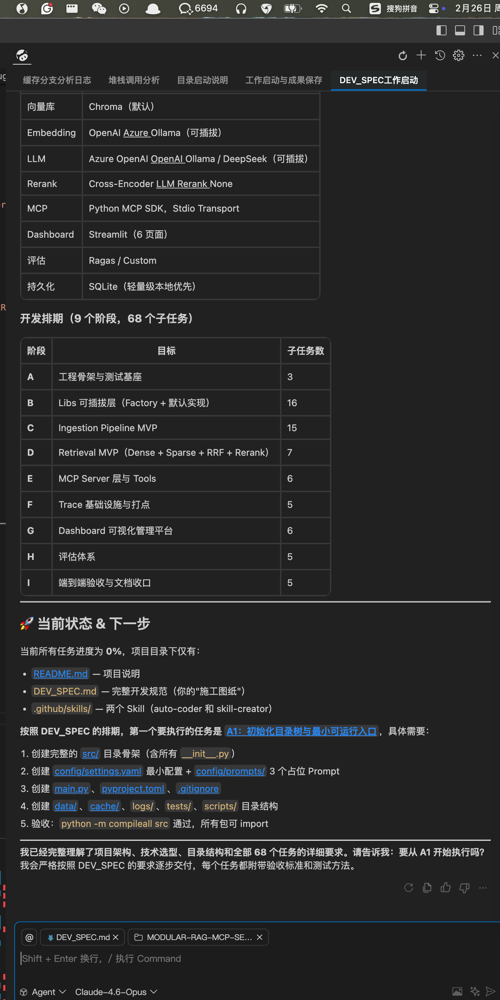
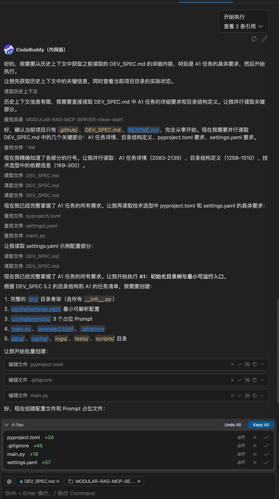
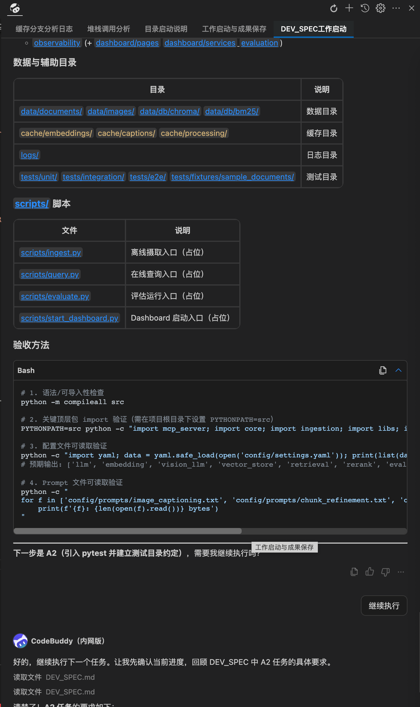

# Modular RAG MCP Server

> 一个可插拔、可观测的模块化 RAG (检索增强生成) 服务框架，通过 MCP (Model Context Protocol) 协议对外暴露工具接口，支持 Copilot / Claude 等 AI 助手直接调用。

---

## ⚠️ 项目状态：开发中 (Work In Progress)

**本项目尚未完成**，
开发过程全程使用agent开发，以下为项目起始阶段，agent的部分输出，通过维护md文件来管理项目进度，以及skill.

其中一个教完整的代码的目录为：https://github.com/yahoo17/Agent-RAG-Complete 此项目已经跑通
<!-- ### ds3.2开发过程

 -->

### Claude4.6开发过程

当前阶段 README 仅提供分支说明，关于项目安装、配置、启动方式等完整文档将在项目完成后补充。`requirements` / `pyproject.toml` 中的依赖列表也可能随开发进展调整，不代表最终版本。

---

## 📂 分支说明

本仓库包含三个分支，各有不同用途：

| 分支 | 用途 | 说明 |
|------|------|------|
| **`main`** | 最新代码 | 始终只有 **1 个 commit**，包含项目的最新完整代码。适合想直接查看最终代码的用户。 |
| **`dev`** | 开发过程记录 | 保留了完整的 commit 历史，记录了从零开始逐步构建整个项目的过程。适合想了解项目是如何一步步搭建的用户。 |
| **`clean-start`** | 干净起点 | 仅包含工程骨架（Skills + DEV_SPEC），DEV_SPEC 中的任务进度全部清零。**适合想从零开始自己动手实现的用户**——fork 此分支，按照 DEV_SPEC 的排期逐步完成即可。 |

---

## 🏗️ 项目概览

- **Ingestion Pipeline**：PDF → Markdown → Chunk → Transform → Embedding → Upsert（支持多模态图片描述）
- **Hybrid Search**：Dense (向量) + Sparse (BM25) + RRF Fusion + 可选 Rerank
- **MCP Server**：通过标准 MCP 协议暴露 `query_knowledge_hub`、`list_collections`、`get_document_summary` 三个 Tools
- **Dashboard**：Streamlit 六页面管理平台（系统总览 / 数据浏览 / Ingestion 管理 / 追踪可视化 / 评估面板）
- **Evaluation**：Ragas + Custom 评估体系，支持 golden test set 回归测试

> 📖 详细架构设计和任务排期请参阅 [DEV_SPEC.md](DEV_SPEC.md)

---

## 📄 License

MIT
